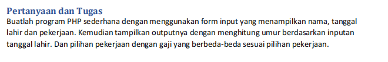

# Lab2Web
<p> Nama : Viena Dwi Putri Maulina </p>
<p> Nim : 312110469 </p>
<p> Kelas: TI.21.C1 </p>
<p> Mata Kuliah : Pemrograman Web 2 </p>
<p> Tugas Pertemuan 3 </p>



<p> index.html <p>

```php
<!DOCTYPE html>
<html lang="en">
<head>
<title>Tugas</title>
</head>
<body>
<form action="output.php" method="post">
<table>
    <tr>
        <td width="100"> Nama  </td>
        <td> : <input type="text" name="nama" /> </td> 
    </tr>
        
    <tr>
        <td>Tanggal Lahir  </td>
        <td> : <input type="date" name="tanggal_lahir"> </td> </tr>
        
    <tr> 
        <td> Pekerjaan  </td>
       <td> : <input type="radio" name="pekerjaan" value="Karyawan"/>Karyawan
        <input type="radio" name="pekerjaan" value="PNS"/>PNS
        <input type="radio" name="pekerjaan" value="Petani"/>Petani
        <input type="radio" name="pekerjaan" value="Wiraswasta"/>Wiraswasta </td>
    </tr>
    <tr>
        <td></td>
        <td> <input type="submit" value="kirim"/> </td>
    </tr>
</table>
</form>
</body>
</html>

```

